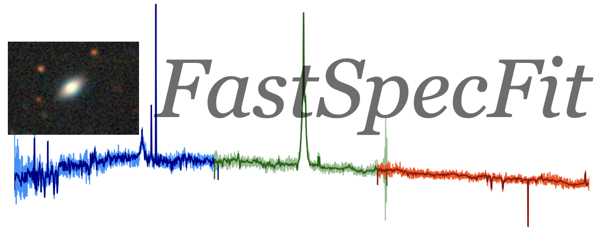

============================================
Welcome to the Documentation for FastSpecFit
============================================

Overview
--------

``FastSpecFit`` is a stellar continuum and emission-line modeling code which is
optimized for speed and simplicity; it uses physically motivated stellar
population synthesis and emission-line templates to jointly model UV/optical
spectrophotometry and ultraviolet through infrared broadband photometry
(``fastspec``). Alternatively, it can be used to model just the broadband
photometry (``fastphot``).

``FastSpecFit`` currently only supports `DESI <https://desi.lbl.gov>`_
spectrophotometric data, although contributions to develop the software for
other instruments and surveys are more than welcome.

Contents
--------

.. toctree::
   :maxdepth: 1

   install.rst
   running.rst
   algorithms.rst
   api.rst
   changes.rst

Value Added Catalogs (VACs)
---------------------------

.. toctree::
   :maxdepth: 1

   vacs.rst
   fuji.rst
   iron.rst
   guadalupe.rst
   acknowledgments.rst

Data Model
----------

.. toctree::
   :maxdepth: 1

   fastspec.rst
   fastphot.rst

Indices & Tables
----------------

* :ref:`genindex`
* :ref:`modindex`
* :ref:`search`
