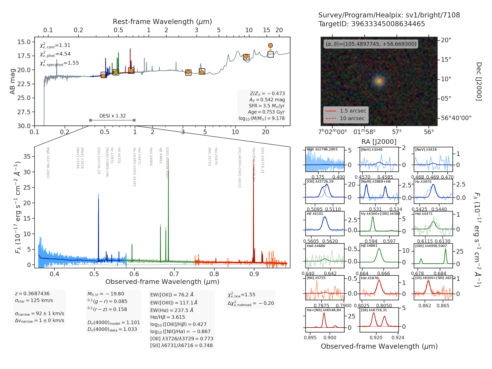
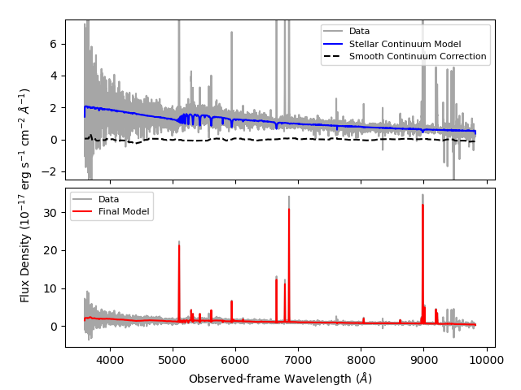
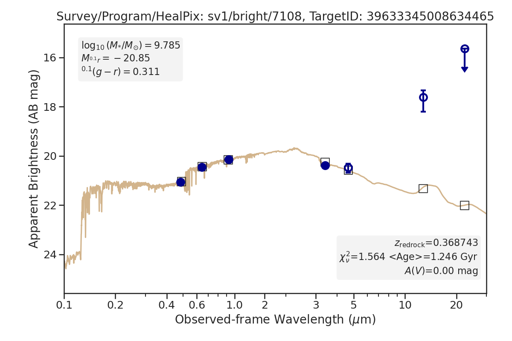

.. _running_fastspecfit:

Running FastSpecFit
===================

.. note::
   
   Before running any of the examples below, we assume that you have
   successfully :ref:`installed and set up<install>` ``FastSpecFit``.

.. contents:: Contents
    :depth: 3

Overview
--------

The primary executable script for ``FastSpecFit`` is called ``fastspec``, which
takes one or more `Redrock`_ redshift catalogs as input (and one or more
corresponding DESI spectra) and, by default, jointly models the DESI
spectrophotometry and broadband photometry.

.. collapse:: Click to view the fastspec help message.

    .. code-block:: bash

        $> fastspec --help
        usage: fastspec [-h] -o OUTFILE [--mp MP] [-n NTARGETS] [--firsttarget FIRSTTARGET] [--targetids TARGETIDS] [--no-broadlinefit] [--nophoto] [--percamera-models]
                        [--imf IMF] [--templateversion TEMPLATEVERSION] [--templates TEMPLATES] [--redrockfile-prefix REDROCKFILE_PREFIX]
                        [--specfile-prefix SPECFILE_PREFIX] [--qnfile-prefix QNFILE_PREFIX] [--mapdir MAPDIR] [--dr9dir DR9DIR] [--specproddir SPECPRODDIR] [--verbose]
                        [redrockfiles ...]
        
        positional arguments:
          redrockfiles          Full path to input redrock file(s). (default: None)
        
        options:
          -h, --help            show this help message and exit
          -o OUTFILE, --outfile OUTFILE
                                Full path to output filename (required). (default: None)
          --mp MP               Number of multiprocessing threads per MPI rank. (default: 1)
          -n NTARGETS, --ntargets NTARGETS
                                Number of targets to process in each file. (default: None)
          --firsttarget FIRSTTARGET
                                Index of first object to to process in each file, zero-indexed. (default: 0)
          --targetids TARGETIDS
                                Comma-separated list of TARGETIDs to process. (default: None)
          --no-broadlinefit     Do not allow for broad Balmer and Helium line-fitting. (default: True)
          --nophoto             Do not include the photometry in the model fitting. (default: False)
          --percamera-models    Return the per-camera (not coadded) model spectra. (default: False)
          --imf IMF             Initial mass function. (default: chabrier)
          --templateversion TEMPLATEVERSION
                                Template version number. (default: 1.0.0)
          --templates TEMPLATES
                                Optional full path and filename to the templates. (default: None)
          --redrockfile-prefix REDROCKFILE_PREFIX
                                Prefix of the input Redrock file name(s). (default: redrock-)
          --specfile-prefix SPECFILE_PREFIX
                                Prefix of the spectral file(s). (default: coadd-)
          --qnfile-prefix QNFILE_PREFIX
                                Prefix of the QuasarNet afterburner file(s). (default: qso_qn-)
          --mapdir MAPDIR       Optional directory name for the dust maps. (default: None)
          --dr9dir DR9DIR       Optional directory name for the DR9 photometry. (default: None)
          --specproddir SPECPRODDIR
                                Optional directory name for the spectroscopic production. (default: None)
          --verbose             Be verbose (for debugging purposes). (default: False)

|

Note that in addition to the `Redrock`_ catalog, ``fastspec`` also requires the
DESI coadded spectrum to be located in the same directory (with a default
*coadd-* prefix). In addition, there are two key support routines, which we
describe in more detail below:

  * ``fastqa``, to build quality assurance (QA) figures; and
  * ``mpi-fastspecfit``, to execute a variety of tasks (in parallel) on larger
    numbers of input files or catalogs.

.. _`RedRock`: https://github.com/desihub/redrock

.. _`fastspec example`:

One fastspec Example
--------------------

To model the spectrum of a single object, we simply provide ``fastspec`` the
full path of an input Redrock catalog, the ``targetid`` of the object we are
interested in, and an (arbitrary) output filename::

  $> fastspec $DESI_ROOT/spectro/redux/iron/healpix/sv1/bright/71/7108/redrock-sv1-bright-7108.fits \
    --targetids 39633345008634465 --outfile fastspec-example.fits

.. collapse:: Click to view the informational output printed to the screen after
              executing this command. 

    .. code-block:: python

        INFO:fastspecfit.py:122:parse: /global/homes/i/ioannis/code/desihub/fastspecfit/bin/fastspec /global/cfs/cdirs/desi/spectro/redux/iron/healpix/sv1/bright/71/7108/redrock-sv1-bright-7108.fits --targetids 39633345008634465 --outfile fastspec-example.fits
        INFO:io.py:525:select: Reading and parsing 1 unique redrockfile(s).
        INFO:io.py:579:select: specprod=iron, coadd_type=healpix, survey=sv1, program=bright, healpix=7108
        INFO:io.py:847:select: Gathered photometric metadata for 1 objects in 0.19 sec
        INFO:io.py:937:read_and_unpack: Reading 1 spectrum from /global/cfs/cdirs/desi/spectro/redux/iron/healpix/sv1/bright/71/7108/coadd-sv1-bright-7108.fits
        INFO:spectra.py:291:read_spectra: iotime 0.215 sec to read coadd-sv1-bright-7108.fits at 2023-02-24T04:49:07.030436
        INFO:io.py:966:read_and_unpack: Coadding across cameras took 0.01 seconds.
        INFO:io.py:111:unpack_one_spectrum: Pre-processing object 0 [targetid 39633345008634465 z=0.368744].
        INFO:fastspecfit.py:174:fastspec: Reading and unpacking 1 spectra to be fitted took 3.57 seconds.
        INFO:fastspecfit.py:50:fastspec_one: Continuum- and emission-line fitting object 0 [targetid 39633345008634465, z=0.368744].
        INFO:io.py:1505:cache_templates: Reading /global/cfs/cdirs/desi/science/gqp/templates/fastspecfit/1.0.0/ftemplates-chabrier-1.0.0.fits
        INFO:continuum.py:1760:continuum_specfit: S/N_b=3.20, S/N_r=6.20, S/N_z=6.04, rest wavelength coverage=2630-7177 A.
        INFO:continuum.py:1775:continuum_specfit: Fitting for the velocity dispersion took 1.44 seconds.
        INFO:continuum.py:1790:continuum_specfit: Finding vdisp failed; adopting vdisp=125 km/s.
        WARNING:continuum.py:1243:templates2data: Padding model spectrum due to insufficient wavelength coverage to synthesize photometry.
        INFO:continuum.py:1857:continuum_specfit: Median aperture correction = 1.320 [1.209-1.471].
        INFO:continuum.py:1884:continuum_specfit: Final fitting with 120 models took 0.38 seconds.
        INFO:continuum.py:1918:continuum_specfit: Spectroscopic DN(4000)=0.944+/-0.028, Model Dn(4000)=1.101
        INFO:continuum.py:1953:continuum_specfit: Smooth continuum correction: b=-0.252%, r=0.125%, z=0.036%
        INFO:continuum.py:1978:continuum_specfit: Mstar=9.178 Msun, Mr=-19.80 mag, A(V)=0.542, Age=0.753 Gyr, SFR=3.535 Msun/yr, Z/Zsun=-0.473
        INFO:continuum.py:2019:continuum_specfit: Continuum-fitting took 2.10 seconds.
        INFO:emlines.py:2337:emline_specfit: Initial line-fitting with 28 free parameters took 0.35 seconds [niter=2, rchi2=1.5841].
        INFO:emlines.py:2381:emline_specfit: Second (broad) line-fitting with 39 free parameters took 0.77 seconds [niter=3, rchi2=1.7877].
        INFO:emlines.py:2386:emline_specfit: Chi2 with broad lines = 1.78772 and without broad lines = 1.58412 [chi2_narrow-chi2_broad=-0.20360]
        INFO:emlines.py:2409:emline_specfit: Dropping broad-line model: delta-rchi2 -0.204<0.000.
        INFO:emlines.py:2517:emline_specfit: Final line-fitting with 35 free parameters took 0.41 seconds [niter=2, rchi2=1.5550].
        INFO:emlines.py:2608:emline_specfit: Dn(4000)=1.033 in the emission-line subtracted spectrum.
        INFO:emlines.py:2649:emline_specfit: Emission-line fitting took 1.71 seconds.
        INFO:fastspecfit.py:214:fastspec: Fitting 1 object(s) took 4.31 seconds.
        INFO:io.py:1335:write_fastspecfit: Writing results for 1 object to fastspec-example.fits
        INFO:io.py:1392:write_fastspecfit: Writing out took 1.38 seconds.

|
        
See the :ref:`fastspec data model<fastspec datamodel>` for a full description of
the contents of the ``fastspec-example.fits`` file which is written out. We can
visualize the results to create the
``fastspec-sv1-bright-7108-39633345008634465.png`` file by invoking the
following command::

  $> fastqa ./fastspec-example.fits --outdir ./

.. collapse:: Click to view the informational output printed to the screen after
              executing this command. 

    .. code-block:: python

        INFO:fastqa:53:parse: /global/homes/i/ioannis/code/desihub/fastspecfit/bin/fastqa ./fastspec-example.fits --outdir ./
        INFO:io.py:1716:read_fastspecfit: Read 1 object(s) from ./fastspec-example.fits
        INFO:fastqa:131:main: Building QA for 1 objects.
        INFO:io.py:665:select: Reading and parsing 1 unique redrockfile(s).
        INFO:io.py:720:select: specprod=iron, coadd_type=healpix, survey=sv1, program=bright, healpix=7108
        INFO:io.py:995:select: Gathered photometric metadata for 1 objects in 0.07 sec
        INFO:io.py:1085:read_and_unpack: Reading 1 spectrum from /global/cfs/cdirs/desi/spectro/redux/iron/healpix/sv1/bright/71/7108/coadd-sv1-bright-7108.fits
        INFO:spectra.py:291:read_spectra: iotime 0.470 sec to read coadd-sv1-bright-7108.fits at 2023-03-31T14:14:14.983411
        INFO:io.py:1114:read_and_unpack: Coadding across cameras took 0.01 seconds.
        INFO:io.py:111:unpack_one_spectrum: Pre-processing object 0 [targetid 39633345008634465 z=0.368744].
        INFO:fastspecfit.py:656:qa_fastspec: timeout 15 wget -q -o /dev/null -O ./tmp.fastspec-sv1-bright-7108-39633345008634465.jpeg "https://www.legacysurvey.org/viewer/jpeg-cutout?ra=105.48977452498902&dec=56.669300058331935&width=114&height=87&layer=ls-dr9"
        INFO:fastspecfit.py:1342:qa_fastspec: Writing ./fastspec-sv1-bright-7108-39633345008634465.png
        INFO:fastqa:241:main: QA for everything took: 12.64 sec

|

The figure above succinctly summarizes the ``fastspec`` inputs and modeling
results:

  * *Upper-right panel*: *grz* color cutout from the *Legacy Surveys* centered
    on the DESI target. The solid and dashed red circle represents the
    :math:`1.5^{"}` diameter DESI fiber aperture and a :math:`10^{"}` reference
    aperture, respectively.

  * *Middle-left panel*: Three-camera observed DESI spectrophotometry and
    best-fitting model, shown as light and dark blue, green, and red spectra,
    respectively, and spanning the observed-frame :math:`0.36-0.98~\mu m`
    wavelength range. The thin, light gray curve around zero flux shows the
    *smooth continuum* correction which is added to the thick, dark gray
    best-fitting stellar population synthesis model (see the :ref:`algorithms
    <Algorithms>` documentation for details).

  * *Top-middle panel*: Observed and modeled broadband spectral energy
    distribution between :math:`0.1-35~\mu m` in the observed frame. The orange
    points (or arrows) show the observed *grz* (optical) and *W1-W4* (infrared)
    fluxes or :math:`2\sigma` upper limits from the *Legacy Surveys*, and the
    open square markers represent the photometry synthesized from the
    best-fitting model. The blue, green, and red spectra in this panel are the
    best-fitting DESI model after multiplying by the derived aperture correction
    (showin the bottom portion of the panel as the factor of 1.32).

  * *Lower-right panel*: Zoomed panels showing the data and best-fit model for
    all the emission lines within the observed spectral range.

In some cases it may be convenient to generate your own figure of the data and
the best-fitting models, which you can do by reading the data yourself and using
the spectra stored in the ``MODELS`` FITS extension:

.. code-block:: python

  import numpy as np
  import fitsio 
  from astropy.table import Table
  import matplotlib.pyplot as plt
  
  from desiutil.dust import dust_transmission
  from desispec.io import read_spectra
  from desispec.coaddition import coadd_cameras
  
  specfile = '/global/cfs/cdirs/desi/spectro/redux/iron/healpix/sv1/bright/71/7108/coadd-sv1-bright-7108.fits'
  fastfile = 'fastspec-example.fits'

  meta = Table(fitsio.read(fastfile, 'METADATA'))
  fast = Table(fitsio.read(fastfile, 'FASTSPEC'))
  
  models, hdr = fitsio.read(fastfile, 'MODELS', header=True)
  modelwave = hdr['CRVAL1'] + np.arange(hdr['NAXIS1']) * hdr['CDELT1']
  
  spec = read_spectra(specfile).select(targets=meta['TARGETID'])
  coadd_spec = coadd_cameras(spec)
  bands = coadd_spec.bands[0]
  
  mw_transmission_spec = dust_transmission(coadd_spec.wave[bands], meta['EBV'])
  
  fig, (ax1, ax2) = plt.subplots(2, 1, sharex=True)
  ax1.plot(coadd_spec.wave[bands], coadd_spec.flux[bands].flatten() / mw_transmission_spec,
           color='gray', alpha=0.7, label='Data')
  ax1.plot(modelwave, models[0, 0, :], label='Stellar Continuum Model', ls='-', color='blue')
  ax1.plot(modelwave, models[0, 1, :], label='Smooth Continuum Correction', ls='--', color='k')
  ax1.set_ylim(-2.5, 7.5)
  ax1.legend(fontsize=8, loc='upper right')

  ax2.plot(coadd_spec.wave[bands], coadd_spec.flux[bands].flatten() / mw_transmission_spec,
           color='gray', alpha=0.7, label='Data')
  ax2.plot(modelwave, np.sum(models, axis=1).flatten(), label='Final Model', ls='-', color='red')
  ax2.legend(fontsize=8, loc='upper left')
  ax2.set_xlabel(r'Observed-frame Wavelength ($\AA$)')

  fig.subplots_adjust(hspace=0.05, top=0.95, right=0.95)
  fig.text(0.05, 0.5, r'Flux Density ($10^{-17}~{\rm erg}~{\rm s}^{-1}~{\rm cm}^{-2}~\AA^{-1}$)',
            ha='center', va='center', rotation='vertical')

  fig.savefig('fastspec-example.png')

.. note::
   
   All the quantities and models returned by ``FastSpecFit`` are measured from
   DESI spectra which have been corrected for Galactic extinction, so the data
   have to be extinction-corrected when generating the figure above.

.. _`fastphot example`:

One fastphot Example
--------------------

``FastSpecFit`` can also model the broadband photometry (at the given DESI
redshift) using ``fastphot``. Using the same example object as above, we have::

  $> fastphot $DESI_ROOT/spectro/redux/iron/healpix/sv1/bright/71/7108/redrock-sv1-bright-7108.fits \
    --targetids 39633345008634465 --outfile fastphot-example.fits

.. collapse:: Click to view the informational output printed to the screen after
              executing this command. 

    .. code-block:: python

        INFO:fastspecfit.py:127:parse: /global/homes/i/ioannis/code/desihub/fastspecfit/bin/fastphot /global/cfs/cdirs/desi/spectro/redux/iron/healpix/sv1/bright/71/7108/redrock-sv1-bright-7108.fits --targetids 39633345008634465 --outfile fastphot-example.fits
        INFO:io.py:665:select: Reading and parsing 1 unique redrockfile(s).
        INFO:io.py:720:select: specprod=iron, coadd_type=healpix, survey=sv1, program=bright, healpix=7108
        INFO:io.py:995:select: Gathered photometric metadata for 1 objects in 0.22 sec
        INFO:io.py:1085:read_and_unpack: Reading 1 spectrum from /global/cfs/cdirs/desi/spectro/redux/iron/healpix/sv1/bright/71/7108/coadd-sv1-bright-7108.fits
        INFO:io.py:111:unpack_one_spectrum: Pre-processing object 0 [targetid 39633345008634465 z=0.368744].
        INFO:fastspecfit.py:194:fastspec: Reading and unpacking 1 spectra to be fitted took 3.22 seconds.
        INFO:fastspecfit.py:51:fastspec_one: Continuum- and emission-line fitting object 0 [targetid 39633345008634465, z=0.368744].
        INFO:continuum.py:1685:continuum_specfit: Adopting nominal vdisp=125 km/s.
        WARNING:continuum.py:1243:templates2data: Padding model spectrum due to insufficient wavelength coverage to synthesize photometry.
        INFO:continuum.py:1706:continuum_specfit: Fitting 120 models took 0.07 seconds.
        INFO:continuum.py:1726:continuum_specfit: Model Dn(4000)=1.139.
        INFO:continuum.py:1981:continuum_specfit: Mstar=9.528 Msun, Mr=-19.92 mag, A(V)=0.817, Age=1.679 Gyr, SFR=1.469 Msun/yr, Z/Zsun=-0.992
        INFO:continuum.py:2022:continuum_specfit: Continuum-fitting took 0.20 seconds.
        INFO:fastspecfit.py:236:fastspec: Fitting 1 object(s) took 0.86 seconds.
        INFO:io.py:1759:write_fastspecfit: Writing results for 1 object to fastphot-example.fits
        INFO:io.py:1816:write_fastspecfit: Writing out took 0.10 seconds.

|

And to generate the QA::

  $> fastqa fastphot-example.fits --outdir ./

.. collapse:: Click to view the informational output printed to the screen after
              executing this command. 

    .. code-block:: python

        INFO:fastqa:53:parse: /global/homes/i/ioannis/code/desihub/fastspecfit/bin/fastqa fastphot-example.fits --outdir ./
        INFO:io.py:1716:read_fastspecfit: Read 1 object(s) from fastphot-example.fits
        INFO:fastqa:131:main: Building QA for 1 objects.
        INFO:io.py:665:select: Reading and parsing 1 unique redrockfile(s).
        INFO:io.py:720:select: specprod=iron, coadd_type=healpix, survey=sv1, program=bright, healpix=7108
        INFO:io.py:995:select: Gathered photometric metadata for 1 objects in 0.10 sec
        INFO:io.py:1085:read_and_unpack: Reading 1 spectrum from /global/cfs/cdirs/desi/spectro/redux/iron/healpix/sv1/bright/71/7108/coadd-sv1-bright-7108.fits
        INFO:io.py:111:unpack_one_spectrum: Pre-processing object 0 [targetid 39633345008634465 z=0.368744].
        INFO:fastspecfit.py:656:qa_fastspec: timeout 15 wget -q -o /dev/null -O ./tmp.fastphot-sv1-bright-7108-39633345008634465.jpeg "https://www.legacysurvey.org/viewer/jpeg-cutout?ra=105.48977452498902&dec=56.669300058331935&width=114&height=87&layer=ls-dr9"
        INFO:fastspecfit.py:1343:qa_fastspec: Writing ./fastphot-sv1-bright-7108-39633345008634465.png
        INFO:fastqa:241:main: QA for everything took: 6.19 sec

Once again, please refer to the :ref:`fastphot data model<fastphot datamodel>`
for a full description of the contents of the ``fastphot-example.fits`` file.

.. note::
   
   As documented above, the orange points (or arrows) show the observed *grz*
   (optical) and *W1-W4* (infrared) fluxes or :math:`2\sigma` upper limits from
   the *Legacy Surveys*, and the open square markers represent the photometry
   synthesized from the best-fitting model.

.. _`production`:

More Examples
-------------

In the examples above, we selected one specific object using the ``--targetids``
optional input, which can also be a comma-separated list. For example::

  $> fastspec /global/cfs/cdirs/desi/spectro/redux/iron/healpix/sv1/bright/71/7108/redrock-sv1-bright-7108.fits \
    --targetids 39633345008634465,39633334917139798,39633348330522913 \
    --outfile fastspec-example2.fits

Alternatively, you may want to fit a subset of the targets on this healpixel,
say the first 20 objects, in which case you would use the ``--ntargets`` keyword::

  $> fastspec /global/cfs/cdirs/desi/spectro/redux/iron/healpix/sv1/bright/71/7108/redrock-sv1-bright-7108.fits \
    --ntargets 20 --outfile fastspec-example3.fits

If you don't want to start at the zeroth object, you can offset by an integer
number of targets using the ``--firsttarget`` option, which in this example
would fit objects 50 through 70::

  $> fastspec /global/cfs/cdirs/desi/spectro/redux/iron/healpix/sv1/bright/71/7108/redrock-sv1-bright-7108.fits \
    --firsttarget 50 --ntargets 20 --outfile fastspec-example4.fits

Finally, when fitting more than one object, you probably want to use
multiprocessing, so that multiple objects are fit simultaneously. We can use
parallelism (assuming you're on a machine with more than one core) using the
``--mp`` input::

  $> fastspec /global/cfs/cdirs/desi/spectro/redux/iron/healpix/sv1/bright/71/7108/redrock-sv1-bright-7108.fits \
    --firsttarget 50 --ntargets 20 --mp 20 --outfile fastspec-example5.fits

You can see all the options by calling either ``fastspec`` or ``fastphot`` with
the ``--help`` option, although most users will only invoke the options
documented above::

  $> fastspec --help
  usage: fastspec [-h] -o OUTFILE [--mp MP] [-n NTARGETS] [--firsttarget FIRSTTARGET] [--targetids TARGETIDS] [--no-broadlinefit] [--nophoto] [--percamera-models]
                  [--imf IMF] [--templateversion TEMPLATEVERSION] [--templates TEMPLATES] [--redrockfile-prefix REDROCKFILE_PREFIX]
                  [--specfile-prefix SPECFILE_PREFIX] [--qnfile-prefix QNFILE_PREFIX] [--mapdir MAPDIR] [--dr9dir DR9DIR] [--specproddir SPECPRODDIR] [--verbose]
                  [redrockfiles ...]
  
  positional arguments:
    redrockfiles          Full path to input redrock file(s). (default: None)
  
  options:
    -h, --help            show this help message and exit
    -o OUTFILE, --outfile OUTFILE
                          Full path to output filename (required). (default: None)
    --mp MP               Number of multiprocessing threads per MPI rank. (default: 1)
    -n NTARGETS, --ntargets NTARGETS
                          Number of targets to process in each file. (default: None)
    --firsttarget FIRSTTARGET
                          Index of first object to to process in each file, zero-indexed. (default: 0)
    --targetids TARGETIDS
                          Comma-separated list of TARGETIDs to process. (default: None)
    --no-broadlinefit     Do not allow for broad Balmer and Helium line-fitting. (default: True)
    --nophoto             Do not include the photometry in the model fitting. (default: False)
    --percamera-models    Return the per-camera (not coadded) model spectra. (default: False)
    --imf IMF             Initial mass function. (default: chabrier)
    --templateversion TEMPLATEVERSION
                          Template version number. (default: 1.0.0)
    --templates TEMPLATES
                          Optional full path and filename to the templates. (default: None)
    --redrockfile-prefix REDROCKFILE_PREFIX
                          Prefix of the input Redrock file name(s). (default: redrock-)
    --specfile-prefix SPECFILE_PREFIX
                          Prefix of the spectral file(s). (default: coadd-)
    --qnfile-prefix QNFILE_PREFIX
                          Prefix of the QuasarNet afterburner file(s). (default: qso_qn-)
    --mapdir MAPDIR       Optional directory name for the dust maps. (default: None)
    --dr9dir DR9DIR       Optional directory name for the DR9 photometry. (default: None)
    --specproddir SPECPRODDIR
                          Optional directory name for the spectroscopic production. (default: None)
    --verbose             Be verbose (for debugging purposes). (default: False)

What if you want to fit a particular survey, program, or healpixel. Do you
really need to specify the full path to each individual Redrock file? No!
``FastSpecFit`` knows how the DESI data are organized, but to access this
information we need to use the higher-level ``mpi-fastspecfit`` script. For
example, to fit all the objects in the *Iron* spectroscopic production from
``survey=sv``, ``program=bright`` and ``healpix=7108``, we would do (here, on a
single interactive Perlmutter node)::

  $> salloc -N 1 -C cpu -A desi -t 00:10:00 --qos interactive -L cfs
  $> source /global/cfs/cdirs/desi/software/desi_environment.sh main
  $> module load fastspecfit/main
  $> export FASTSPECFIT_TEMPLATES=$DESI_ROOT/science/gqp/templates/SSP-CKC14z
  $> time mpi-fastspecfit --specprod iron --survey sv1 --program bright \
    --healpix 7108 --mp 128 --outdir-data .
  $> ls -l ./iron/healpix/sv1/bright/71/7108
  
  INFO:mpi.py:223:_findfiles: Building file list for survey=sv1 and program=bright
  INFO:mpi.py:309:plan: Found 1/1 redrockfiles (left) to do.
  INFO:mpi-fastspecfit:46:run_fastspecfit: Planning took 0.16 sec
  INFO:mpi-fastspecfit:96:run_fastspecfit: Rank 0, ntargets=264: fastspec /global/cfs/cdirs/desi/spectro/redux/iron/healpix/sv1/bright/71/7108/redrock-sv1-bright-7108.fits -o ./iron/healpix/sv1/bright/71/7108/fastspec-sv1-bright-7108.fits --mp 128
  INFO:mpi-fastspecfit:119:run_fastspecfit:   rank 0 done in 113.58 sec
  INFO:mpi-fastspecfit:140:run_fastspecfit: All done at Sun Aug  7 06:17:02 2022
  
  real	1m55.770s
  user	14m38.856s
  sys	1m16.424s  

  total 12092
  -rw-rw-r-- 1 ioannis ioannis 12007670 Aug  7 06:17 fastspec-sv1-bright-7108.fits
  -rw-rw-r-- 1 ioannis ioannis   370424 Aug  7 06:17 fastspec-sv1-bright-7108.log

Since fitting can be relatively expensive (in this case, it took about two
minutes to fit 264 targets with 128 cores), you may want to see what's going to
happen before fitting large numbers of objects, which we can do using the
``--plan`` and/or ``--dry-run`` options::

  $> mpi-fastspecfit --specprod iron --survey sv1 --program bright \
    --healpix 7108 --outdir-data . --plan
    
  INFO:mpi.py:223:_findfiles: Building file list for survey=sv1 and program=bright
  INFO:mpi.py:309:plan: Found 1/1 redrockfiles (left) to do.

  $> mpi-fastspecfit --specprod iron --survey sv1 --program bright \
    --healpix 7108 --outdir-data . --dry-run
    
  INFO:mpi.py:223:_findfiles: Building file list for survey=sv1 and program=bright
  INFO:mpi.py:309:plan: Found 1/1 redrockfiles (left) to do.
  INFO:mpi-fastspecfit:46:run_fastspecfit: Planning took 0.01 sec
  INFO:mpi-fastspecfit:96:run_fastspecfit: Rank 0, ntargets=264: fastspec /global/cfs/cdirs/desi/spectro/redux/iron/healpix/sv1/bright/71/7108/redrock-sv1-bright-7108.fits -o ./iron/healpix/sv1/bright/71/7108/fastspec-sv1-bright-7108.fits --mp 128

If you leave off any combination of the ``--survey``, ``--program``, and/or
``--healpix`` options, the code will assume that you want all the possible
values of these keywords. For example, to see how many SV3 Redrock files would
need to be fit (not recommended without MPI parallelism!), one would do::

  $> mpi-fastspecfit --specprod iron --survey sv3 --outdir-data . --plan
  INFO:mpi.py:223:_findfiles: Building file list for survey=sv3 and program=bright
  INFO:mpi.py:223:_findfiles: Building file list for survey=sv3 and program=dark
  INFO:mpi.py:223:_findfiles: Building file list for survey=sv3 and program=other
  INFO:mpi.py:223:_findfiles: Building file list for survey=sv3 and program=backup
  INFO:mpi.py:309:plan: Found 1023/1023 redrockfiles (left) to do.
  INFO:mpi.py:326:plan: Skipping 70 files with no targets.

.. note::  

  One must always specify the spectroscopic production when calling
  ``mpi-fastspecfit``, in this case ``--specprod iron``. 

To fit the broadband photometry instead of the DESI spectroscopy, simply call
any of the examples in this section with the ``--fastphot`` option::

  $> mpi-fastspecfit --specprod iron --survey sv3 --outdir-data . --plan --fastphot
  INFO:mpi.py:223:_findfiles: Building file list for survey=sv3 and program=bright
  INFO:mpi.py:223:_findfiles: Building file list for survey=sv3 and program=dark
  INFO:mpi.py:223:_findfiles: Building file list for survey=sv3 and program=other
  INFO:mpi.py:223:_findfiles: Building file list for survey=sv3 and program=backup
  INFO:mpi.py:309:plan: Found 1023/1023 redrockfiles (left) to do.
  INFO:mpi.py:326:plan: Skipping 70 files with no targets.

Finally, ``mpi-fastspecfit`` also knows about the tile-based *cumulative*,
*per-night*, and *per-exposure* coadds via the ``--coadd-type`` optional
input. For example::

  $> mpi-fastspecfit --specprod iron --coadd-type cumulative --tile 80613 --outdir-data . --plan
  INFO:mpi.py:309:plan: Found 10/10 redrockfiles (left) to do.

  $> mpi-fastspecfit --specprod iron --coadd-type pernight --tile 80613 --outdir-data . --plan
  INFO:mpi.py:309:plan: Found 57/57 redrockfiles (left) to do.
  
  $> mpi-fastspecfit --specprod iron --coadd-type perexp --tile 80613 --outdir-data . --plan
  INFO:mpi.py:309:plan: Found 283/283 redrockfiles (left) to do.
