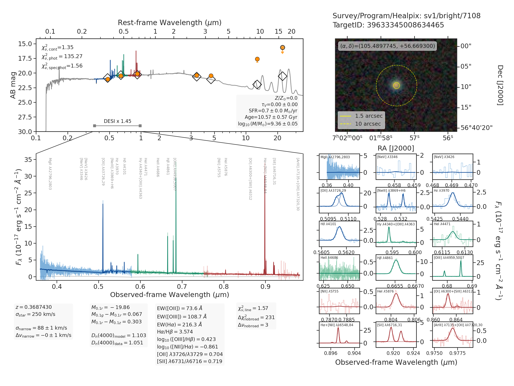
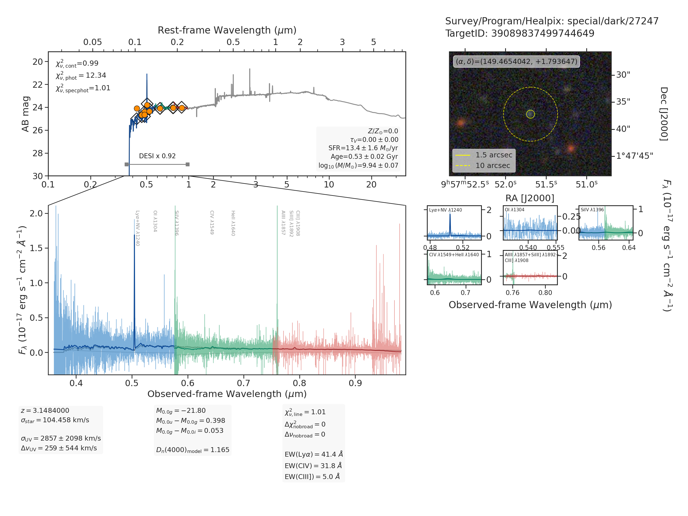
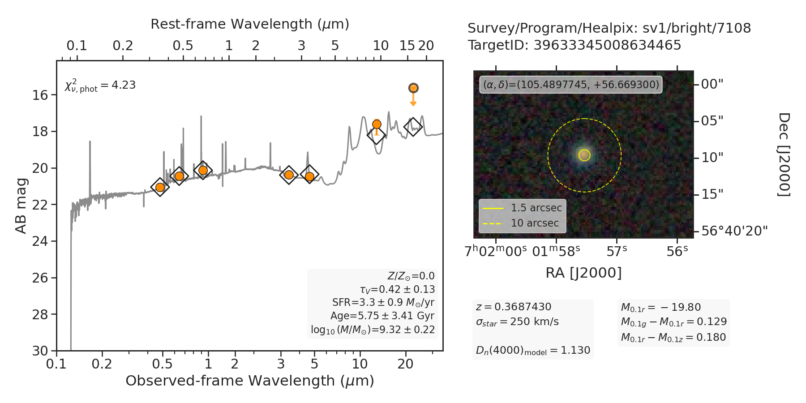
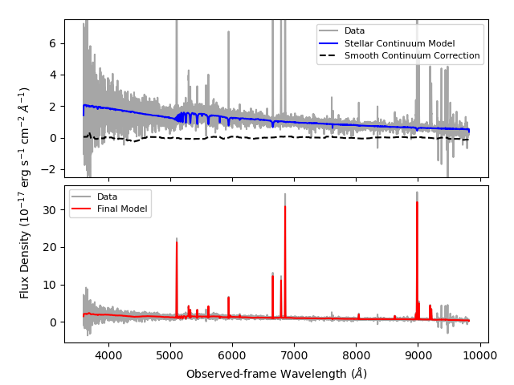

.. _running_fastspecfit:

Running FastSpecFit
===================

.. contents:: Contents
    :depth: 3

This page covers running ``FastSpecFit`` interactively on individual objects and
at scale across large datasets. For reading and working with existing output
catalogs, see :ref:`Working with FastSpecFit Data<data>`. For worked examples,
see the :ref:`Tutorials<tutorials>` page.

.. _fitting_individual:

Fitting Individual Objects
--------------------------

.. note::

   The examples in this section and in :ref:`Fitting at Scale<fitting_at_scale>`
   assume that ``FastSpecFit`` has been successfully
   :ref:`installed and set up<install>`.

``fastspec`` jointly models the DESI spectrophotometry and broadband
photometry for one or more objects, taking one or more `Redrock`_ redshift
catalogs as input. ``fastphot`` models only the broadband photometry and is
significantly faster. Both tools write results to a multi-extension FITS file
described in the :ref:`data model<fastspec datamodel>` pages.

.. dropdown:: Click to view the fastspec help message.

    .. code-block:: bash

        fastspec --help
        usage: fastspec [-h] -o OUTFILE [--mp MP] [-n NTARGETS] [--firsttarget FIRSTTARGET] [--targetids TARGETIDS] [--input-redshifts INPUT_REDSHIFTS] [--input-seeds INPUT_SEEDS]
                        [--seed SEED] [--nmonte NMONTE] [--vdisp-nominal VDISP_NOMINAL] [--vdisp-bounds VDISP_BOUNDS VDISP_BOUNDS] [--zmin ZMIN] [--no-broadlinefit]
                        [--ignore-photometry] [--ignore-quasarnet] [--constrain-age] [--no-smooth-continuum] [--imf IMF] [--templateversion TEMPLATEVERSION] [--templates TEMPLATES]
                        [--redrockfile-prefix REDROCKFILE_PREFIX] [--specfile-prefix SPECFILE_PREFIX] [--qnfile-prefix QNFILE_PREFIX] [--mapdir MAPDIR] [--fphotodir FPHOTODIR]
                        [--fphotofile FPHOTOFILE] [--emlinesfile EMLINESFILE] [--redux_dir REDUX_DIR] [--specproddir SPECPRODDIR] [--uncertainty-floor UNCERTAINTY_FLOOR]
                        [--minsnr-balmer-broad MINSNR_BALMER_BROAD] [--debug-plots] [--verbose]
                        redrockfiles [redrockfiles ...]

        positional arguments:
          redrockfiles          Full path to input redrock file(s).

        options:
          -h, --help            show this help message and exit
          -o OUTFILE, --outfile OUTFILE
                                Full path to output filename (required). (default: None)
          --mp MP               Number of multiprocessing threads per MPI rank. (default: 1)
          -n NTARGETS, --ntargets NTARGETS
                                Number of targets to process in each file. (default: None)
          --firsttarget FIRSTTARGET
                                Index of first object to to process in each file, zero-indexed. (default: 0)
          --targetids TARGETIDS
                                Comma-separated list of TARGETIDs to process. (default: None)
          --input-redshifts INPUT_REDSHIFTS
                                Comma-separated list of input redshifts corresponding to the (required) --targetids input. (default: None)
          --input-seeds INPUT_SEEDS
                                Comma-separated list of input random-number seeds corresponding to the (required) --targetids input. (default: None)
          --seed SEED           Random seed for Monte Carlo reproducibility; ignored if --input-seeds is passed. (default: 1)
          --nmonte NMONTE       Number of Monte Carlo realizations. (default: 50)
          --vdisp-nominal VDISP_NOMINAL
                                Nominal (default) velocity dispersion in km/s. (default: 250.0)
          --vdisp-bounds VDISP_BOUNDS VDISP_BOUNDS
                                Nominal (default) velocity dispersion in km/s. (default: (75.0, 500.0))
          --zmin ZMIN           Override the default minimum redshift required for modeling. (default: None)
          --no-broadlinefit     Do not model broad Balmer and helium line-emission. (default: True)
          --ignore-photometry   Ignore the broadband photometry during model fitting. (default: False)
          --ignore-quasarnet    Do not use QuasarNet to improve QSO redshifts. (default: True)
          --constrain-age       Constrain the age of the SED. (default: False)
          --no-smooth-continuum
                                Do not fit the smooth continuum. (default: False)
          --imf IMF             Initial mass function. (default: chabrier)
          --templateversion TEMPLATEVERSION
                                Template version number. (default: 2.0.0)
          --templates TEMPLATES
                                Optional full path and filename to the templates. (default: None)
          --redrockfile-prefix REDROCKFILE_PREFIX
                                Prefix of the input Redrock file name(s). (default: redrock-)
          --specfile-prefix SPECFILE_PREFIX
                                Prefix of the spectral file(s). (default: coadd-)
          --qnfile-prefix QNFILE_PREFIX
                                Prefix of the QuasarNet afterburner file(s). (default: qso_qn-)
          --mapdir MAPDIR       Optional directory name for the dust maps. (default: None)
          --fphotodir FPHOTODIR
                                Top-level location of the source photometry. (default: None)
          --fphotofile FPHOTOFILE
                                Photometric information file. (default: None)
          --emlinesfile EMLINESFILE
                                Emission line parameter file. (default: None)
          --redux_dir REDUX_DIR
                                Optional full path $DESI_SPECTRO_REDUX. (default: None)
          --specproddir SPECPRODDIR
                                Optional directory name for the spectroscopic production. (default: None)
          --uncertainty-floor UNCERTAINTY_FLOOR
                                Minimum fractional uncertainty to add in quadrature to the formal inverse variance spectrum. (default: 0.01)
          --minsnr-balmer-broad MINSNR_BALMER_BROAD
                                Minimum broad Balmer S/N to force broad+narrow-line model. (default: 2.5)
          --debug-plots         Generate a variety of debugging plots (written to $PWD). (default: False)
          --verbose             Be verbose (for debugging purposes). (default: False)

.. note::

   In addition to the `Redrock`_ catalog, ``fastspec`` requires the DESI
   coadded spectrum to be located in the same directory (with a default
   *coadd-* prefix).

.. _`fastspec example`:

Running fastspec
~~~~~~~~~~~~~~~~

To model the spectrum of a single object, provide ``fastspec`` the full path
of an input Redrock catalog, the ``targetid`` of the object of interest, and
an output filename::

  fastspec $DESI_SPECTRO_REDUX/loa/healpix/sv1/bright/71/7108/redrock-sv1-bright-7108.fits \
    --targetids 39633345008634465 --outfile ./fastspec-example.fits

.. dropdown:: Click to view the logging output.

    .. code-block:: none

        INFO:fastspecfit.py:302:fastspec: Cached stellar templates /global/cfs/cdirs/desi/public/external/templates/fastspecfit/2.0.0/ftemplates-chabrier-2.0.0.fits
        INFO:fastspecfit.py:303:fastspec: Cached emission-line table /global/common/software/desi/users/ioannis/fastspecfit/py/fastspecfit/data/emlines.ecsv
        INFO:fastspecfit.py:304:fastspec: Cached photometric filters and parameters /global/common/software/desi/users/ioannis/fastspecfit/py/fastspecfit/data/legacysurvey-dr9.yaml
        INFO:fastspecfit.py:305:fastspec: Cached cosmology table /global/common/software/desi/users/ioannis/fastspecfit/py/fastspecfit/data/desi_fiducial_cosmology.dat
        INFO:fastspecfit.py:306:fastspec: Cached Inoue+2014 IGM attenuation parameters.
        INFO:io.py:728:gather_metadata: specprod=loa, coadd_type=healpix, survey=sv1, program=bright, healpix=7108
        INFO:io.py:1063:read: Reading 1 spectrum from /global/cfs/cdirs/desi/spectro/redux/loa/healpix/sv1/bright/71/7108/coadd-sv1-bright-7108.fits
        INFO:fastspecfit.py:154:fastspec_one: Continuum- and emission-line fitting object 0 [targetid 39633345008634465, seed 2032329983, z=0.368743].
        INFO:continuum.py:1456:continuum_fastspec: Median spectral S/N_b=3.42 S/N_r=6.45 S/N_z=6.19
        INFO:continuum.py:1320:vdisp_by_chi2scan: Initial velocity dispersion fit failed: delta-chi2=6<25
        INFO:continuum.py:1647:continuum_fastspec: Median aperture correction 1.451 [1.175-1.839].
        INFO:continuum.py:1844:continuum_specfit: Smooth continuum correction: b=7.370% r=1.651% z=-2.640%
        INFO:continuum.py:2049:continuum_specfit: vdisp=250.00 km/s log(M/Msun)=9.36+/-0.05 tau(V)=0.00+/-0.00 Age=10.57+/-0.57 Gyr SFR=0.73+/-0.03 Msun/yr Z/Zsun=0.00
        INFO:emlines.py:1722:emline_specfit: delta(v) UV=0.0 km/s Balmer broad=0.0 km/s narrow=-0.5+/-1.1 km/s
        INFO:emlines.py:1732:emline_specfit: sigma UV=0 km/s Balmer broad=0 km/s narrow=88+/-1 km/s
        INFO:emlines.py:1763:emline_specfit: Dn(4000)=1.051 in the emission-line subtracted spectrum.
        INFO:fastspecfit.py:433:fastspec: Fitting 1 object(s) took 9.12 seconds.
        INFO:io.py:1649:write: Writing 1 object to fastspec-example.fits

|

See the :ref:`fastspec data model<fastspec datamodel>` for a full description
of the output file. Visualize the results using ``fastqa``::

  fastqa ./fastspec-example.fits --outdir ./

.. dropdown:: Click to view the logging output.

    .. code-block:: none

        INFO:qa.py:1447:parse: /global/common/software/desi/users/ioannis/fastspecfit/bin/fastqa ./fastspec-example.fits --outdir ./
        INFO:io.py:1530:read_fastspecfit: Read 1 object(s) from ./fastspec-example.fits
        INFO:qa.py:1546:fastqa: Building QA for 1 objects.
        INFO:qa.py:1586:fastqa: Cached stellar templates /global/cfs/cdirs/desi/public/external/templates/fastspecfit/2.0.0/ftemplates-chabrier-2.0.0.fits
        INFO:qa.py:1587:fastqa: Cached emission-line table /global/common/software/desi/users/ioannis/fastspecfit/py/fastspecfit/data/emlines.ecsv
        INFO:qa.py:1588:fastqa: Cached photometric filters and parameters /global/common/software/desi/users/ioannis/fastspecfit/py/fastspecfit/data/legacysurvey-dr9.yaml
        INFO:qa.py:1589:fastqa: Cached cosmology table /global/common/software/desi/users/ioannis/fastspecfit/py/fastspecfit/data/desi_fiducial_cosmology.dat
        INFO:qa.py:1590:fastqa: Cached Inoue+2014 IGM attenuation parameters.
        INFO:io.py:728:gather_metadata: specprod=loa, coadd_type=healpix, survey=sv1, program=bright, healpix=7108
        INFO:io.py:1063:read: Reading 1 spectrum from /global/cfs/cdirs/desi/spectro/redux/loa/healpix/sv1/bright/71/7108/coadd-sv1-bright-7108.fits
        INFO:qa.py:675:qa_fastspec: https://www.legacysurvey.org/viewer/jpeg-cutout?ra=105.48977452498902&dec=56.669300058331935&width=114&height=87&layer=ls-dr9
        INFO:qa.py:1395:qa_fastspec: Writing ./fastspec-sv1-bright-7108-39633345008634465.png

|

The figure above succinctly summarizes the ``fastspec`` inputs and modeling
results:

  * *Upper-right panel*: *grz* color cutout from the *Legacy Surveys*
    centered on the DESI target. The solid and dashed yellow circles
    represent the :math:`1.5^{"}` diameter DESI fiber aperture and a
    :math:`10^{"}` reference aperture, respectively.

  * *Middle-left panel*: Three-camera observed DESI spectrophotometry
    and best-fitting model, shown as light and dark blue, green, and
    red spectra, respectively, and spanning the observed-frame
    :math:`0.36-0.98~\mu m` wavelength range. The thin, light gray
    curve around zero flux shows the *smooth continuum* correction
    which is added to the thick, dark gray best-fitting stellar
    population synthesis model (see the :ref:`algorithms <Algorithms>`
    documentation for details).

  * *Top-middle panel*: Observed and modeled broadband spectral energy
    distribution between :math:`0.1-35~\mu m` in the observed frame. The orange
    points (or arrows) show the observed *grz* (optical) and *W1-W4* (infrared)
    fluxes or :math:`2\sigma` upper limits from the *Legacy Surveys*, and the
    open square markers represent the photometry synthesized from the
    best-fitting model. The blue, green, and red spectra in this panel are the
    best-fitting DESI model after multiplying by the derived aperture correction
    (shown in the bottom portion of the panel as the factor of 1.32).

  * *Lower-right panel*: Zoomed panels showing the data and best-fit model for
    all the emission lines within the observed spectral range.

.. _`fastspec external photometry`:

Running fastspec with External Photometry
~~~~~~~~~~~~~~~~~~~~~~~~~~~~~~~~~~~~~~~~~

By default ``fastspec`` reads broadband photometry from the *Legacy Surveys*
DR9 catalog. To use a custom photometric dataset instead, pass two additional
arguments:

* ``--fphotodir`` — path to a FITS file containing the photometric catalog,
  with the FITS extension name (optionally) appended in square brackets
  (e.g. ``catalog.fits[PHOTINFO]``).
* ``--fphotofile`` — path to a YAML file that defines the photometric bands,
  filter curves, flux column names, and fitting strategy. See
  ``py/fastspecfit/data/legacysurvey-dr9.yaml`` for an annotated example.

The example below fits a high-redshift galaxy observed with the *loa*
spectroscopic production against Subaru Suprime-Cam and HSC photometry.
``--input-redshifts`` overrides the Redrock redshift with a better-determined
value, and ``--constrain-age`` restricts stellar templates to ages younger than
the age of the Universe at the object's redshift::

  fastspec $DESI_SPECTRO_REDUX/loa/healpix/special/dark/272/27247/redrock-special-dark-27247.fits \
    --fphotodir=$DESI_ROOT/users/ioannis/desihiz/suprime/v20260616/desi-suprime.fits[PHOTINFO] \
    --fphotofile=$DESI_ROOT/users/ioannis/desihiz/phot/suprime-photinfo.yaml \
    --targetids=39089837499744649 --input-redshifts=3.1484 \
    --constrain-age -o ./fastspec-suprime.fits

.. dropdown:: Click to view the logging output.

    .. code-block:: none

        INFO:fastspecfit.py:327:fastspec: fsftime 1.74 sec for sc_data_init at 2026-06-23T10:35:49.708
        INFO:fastspecfit.py:340:fastspec: Cached stellar templates /dvs_ro/cfs/cdirs/desi/public/external/templates/fastspecfit/2.1.0/ftemplates-chabrier-2.1.0.fits
        INFO:fastspecfit.py:341:fastspec: Cached emission-line table /global/common/software/desi/users/ioannis/fastspecfit/py/fastspecfit/data/emlines.ecsv
        INFO:fastspecfit.py:342:fastspec: Cached photometric filters and parameters /global/cfs/cdirs/desi/users/ioannis/desihiz/phot/suprime-photinfo.yaml
        INFO:fastspecfit.py:343:fastspec: Cached cosmology table /global/common/software/desi/users/ioannis/fastspecfit/py/fastspecfit/data/desi_fiducial_cosmology.dat
        INFO:fastspecfit.py:344:fastspec: Cached Inoue+2014 IGM attenuation parameters.
        INFO:io.py:729:gather_metadata: specprod=loa, coadd_type=healpix, survey=special, program=dark, healpix=27247
        INFO:io.py:852:gather_metadata: Applying 1 input_redshifts.
        INFO:io.py:1468:_gather_photometry: Read 3,145 objects from /global/cfs/cdirs/desi/users/ioannis/desihiz/suprime/v20260616/desi-suprime.fits
        INFO:io.py:1072:read: Reading 1 spectrum from /dvs_ro/cfs/cdirs/desi/spectro/redux/loa/healpix/special/dark/272/27247/coadd-special-dark-27247.fits
        INFO:io.py:1180:read: fsftime 0.70 sec for read_spectra [nobj=1, nfiles=1] at 2026-06-23T10:36:46.665
        INFO:fastspecfit.py:191:fastspec_one: Continuum- and emission-line fitting object 0 [targetid 39089837499744649, seed 2032329983, z=3.148400].
        INFO:continuum.py:1728:continuum_fastspec: Median spectral S/N_b=0.52 S/N_r=0.71 S/N_z=0.70
        INFO:continuum.py:1920:continuum_fastspec: Median aperture correction 0.923 [0.895-1.047].
        INFO:continuum.py:2128:continuum_specfit: Smooth continuum correction: b=2.620% r=-5.696% z=2.798%
        INFO:continuum.py:2322:continuum_specfit: vdisp=95.45 km/s log(M/Msun)=9.94+/-0.07 tau(V)=0.00+/-0.00 Age=0.53+/-0.02 Gyr SFR=13.43+/-1.64 Msun/yr Z/Zsun=0.00
        INFO:emlines.py:1775:emline_specfit: Skipping broad-line fitting (no broad Balmer lines in the spectral range).
        INFO:emlines.py:1942:emline_specfit: delta(v) UV=258.8+/-544.4 km/s Balmer broad=0.0 km/s narrow=0.0 km/s
        INFO:emlines.py:1952:emline_specfit: sigma UV=2857+/-2098 km/s Balmer broad=0 km/s narrow=0 km/s
        INFO:fastspecfit.py:236:fastspec_one: fsftime 2.14 sec for fastspec_one [targetid=39089837499744649] at 2026-06-23T10:36:48.878
        INFO:fastspecfit.py:478:fastspec: fsftime 2.61 sec for fit_all [nobj=1,2.61s/obj/core] at 2026-06-23T10:36:49.341
        INFO:io.py:1671:write: Writing 1 object to ./fastspec-suprime.fits
        INFO:io.py:1742:write_fastspecfit: fsftime 1.73 sec for write_fastspecfit [file=fastspec-suprime.fits] at 2026-06-23T10:36:51.076

|

Generate the QA figure with::

  fastqa ./fastspec-suprime.fits \
    --redrockfiles=$DESI_SPECTRO_REDUX/loa/healpix/special/dark/272/27247/redrock-special-dark-27247.fits \
    --fphotodir=$DESI_ROOT/users/ioannis/desihiz/suprime/v20260616/desi-suprime.fits[PHOTINFO] \
    --fphotofile=$DESI_ROOT/users/ioannis/desihiz/phot/suprime-photinfo.yaml \
    --outdir ./

.. dropdown:: Click to view the logging output.

    .. code-block:: none

        INFO:io.py:1549:read_fastspecfit: Read 1 object(s) from ./fastspec-suprime.fits
        INFO:qa.py:1837:fastqa: Building QA for 1 objects.
        INFO:qa.py:1877:fastqa: Cached stellar templates /dvs_ro/cfs/cdirs/desi/public/external/templates/fastspecfit/2.1.0/ftemplates-chabrier-2.1.0.fits
        INFO:qa.py:1878:fastqa: Cached emission-line table /global/common/software/desi/users/ioannis/fastspecfit/py/fastspecfit/data/emlines.ecsv
        INFO:qa.py:1879:fastqa: Cached photometric filters and parameters /global/cfs/cdirs/desi/users/ioannis/desihiz/phot/suprime-photinfo.yaml
        INFO:qa.py:1880:fastqa: Cached cosmology table /global/common/software/desi/users/ioannis/fastspecfit/py/fastspecfit/data/desi_fiducial_cosmology.dat
        INFO:qa.py:1881:fastqa: Cached Inoue+2014 IGM attenuation parameters.
        INFO:io.py:729:gather_metadata: specprod=loa, coadd_type=healpix, survey=special, program=dark, healpix=27247
        INFO:io.py:852:gather_metadata: Applying 1 input_redshifts.
        INFO:io.py:1468:_gather_photometry: Read 3,145 objects from /global/cfs/cdirs/desi/users/ioannis/desihiz/suprime/v20260616/desi-suprime.fits
        INFO:io.py:1072:read: Reading 1 spectrum from /dvs_ro/cfs/cdirs/desi/spectro/redux/loa/healpix/special/dark/272/27247/coadd-special-dark-27247.fits
        INFO:io.py:1180:read: fsftime 0.28 sec for read_spectra [nobj=1, nfiles=1] at 2026-06-23T10:38:50.824
        INFO:qa.py:734:_fetch_cutout: https://www.legacysurvey.org/viewer/jpeg-cutout?ra=149.465404248889&dec=1.7936467486355945&width=176&height=135&layer=hsc-dr3
        INFO:qa.py:1686:qa_fastspec: Writing ./fastspec-special-dark-27247-39089837499744649.png

|

.. _`fastphot example`:

Running fastphot
~~~~~~~~~~~~~~~~

``fastphot`` models only the broadband photometry at the `Redrock`_ redshift,
and is significantly faster than ``fastspec``. Using the same example object::

  fastphot $DESI_SPECTRO_REDUX/loa/healpix/sv1/bright/71/7108/redrock-sv1-bright-7108.fits \
    --targetids 39633345008634465 --outfile ./fastphot-example.fits

.. dropdown:: Click to view the logging output.

    .. code-block:: none

        INFO:fastspecfit.py:302:fastspec: Cached stellar templates /global/cfs/cdirs/desi/public/external/templates/fastspecfit/2.0.0/ftemplates-chabrier-2.0.0.fits
        INFO:fastspecfit.py:303:fastspec: Cached emission-line table /global/common/software/desi/users/ioannis/fastspecfit/py/fastspecfit/data/emlines.ecsv
        INFO:fastspecfit.py:304:fastspec: Cached photometric filters and parameters /global/common/software/desi/users/ioannis/fastspecfit/py/fastspecfit/data/legacysurvey-dr9.yaml
        INFO:fastspecfit.py:305:fastspec: Cached cosmology table /global/common/software/desi/users/ioannis/fastspecfit/py/fastspecfit/data/desi_fiducial_cosmology.dat
        INFO:fastspecfit.py:306:fastspec: Cached Inoue+2014 IGM attenuation parameters.
        INFO:io.py:728:gather_metadata: specprod=loa, coadd_type=healpix, survey=sv1, program=bright, healpix=7108
        INFO:io.py:1063:read: Reading 1 spectrum from /global/cfs/cdirs/desi/spectro/redux/loa/healpix/sv1/bright/71/7108/coadd-sv1-bright-7108.fits
        INFO:fastspecfit.py:151:fastspec_one: Continuum fitting object 0 [targetid 39633345008634465, seed 2032329983, z=0.368743].
        INFO:continuum.py:1222:continuum_fastphot: Fitting 5 models took 0.05 seconds [rchi2_phot=4.2, ndof=7].
        INFO:continuum.py:1248:continuum_fastphot: Model Dn(4000)=1.130+/-0.017 tau(V)=0.423+/-0.133 mag vdisp=250 km/s
        INFO:continuum.py:2049:continuum_specfit: vdisp=250.00 km/s log(M/Msun)=9.32+/-0.22 tau(V)=0.42+/-0.13 Age=5.75+/-3.41 Gyr SFR=3.34+/-0.85 Msun/yr Z/Zsun=0.00
        INFO:fastspecfit.py:433:fastspec: Fitting 1 object(s) took 2.86 seconds.
        INFO:io.py:1649:write: Writing 1 object to ./fastphot-example.fits

|

And to generate the QA::

  fastqa fastphot-example.fits --outdir ./

.. dropdown:: Click to view the logging output.

    .. code-block:: none

        INFO:qa.py:1447:parse: /global/common/software/desi/users/ioannis/fastspecfit/bin/fastqa fastphot-example.fits --outdir ./
        INFO:io.py:1530:read_fastspecfit: Read 1 object(s) from fastphot-example.fits
        INFO:qa.py:1546:fastqa: Building QA for 1 objects.
        INFO:qa.py:1586:fastqa: Cached stellar templates /global/cfs/cdirs/desi/public/external/templates/fastspecfit/2.0.0/ftemplates-chabrier-2.0.0.fits
        INFO:qa.py:1587:fastqa: Cached emission-line table /global/common/software/desi/users/ioannis/fastspecfit/py/fastspecfit/data/emlines.ecsv
        INFO:qa.py:1588:fastqa: Cached photometric filters and parameters /global/common/software/desi/users/ioannis/fastspecfit/py/fastspecfit/data/legacysurvey-dr9.yaml
        INFO:qa.py:1589:fastqa: Cached cosmology table /global/common/software/desi/users/ioannis/fastspecfit/py/fastspecfit/data/desi_fiducial_cosmology.dat
        INFO:qa.py:1590:fastqa: Cached Inoue+2014 IGM attenuation parameters.
        INFO:io.py:728:gather_metadata: specprod=loa, coadd_type=healpix, survey=sv1, program=bright, healpix=7108
        INFO:io.py:1063:read: Reading 1 spectrum from /global/cfs/cdirs/desi/spectro/redux/loa/healpix/sv1/bright/71/7108/coadd-sv1-bright-7108.fits
        INFO:qa.py:675:qa_fastspec: https://www.legacysurvey.org/viewer/jpeg-cutout?ra=105.48977452498902&dec=56.669300058331935&width=114&height=87&layer=ls-dr9
        INFO:qa.py:1395:qa_fastspec: Writing ./fastphot-sv1-bright-7108-39633345008634465.png

|

Refer to the :ref:`fastphot data model<fastphot datamodel>` for a full
description of the output file.

.. note::

   The orange points (or arrows) show the observed *grz* (optical) and
   *W1-W4* (infrared) fluxes or :math:`2\sigma` upper limits from the
   *Legacy Surveys*, and the open square markers represent the photometry
   synthesized from the best-fitting model.

Plotting the Best-Fit Model
~~~~~~~~~~~~~~~~~~~~~~~~~~~

The ``MODELS`` extension stores the best-fit spectral components, making it
straightforward to generate custom figures:

.. code-block:: python

  import numpy as np
  import fitsio
  from astropy.table import Table
  import matplotlib.pyplot as plt

  from desiutil.dust import dust_transmission
  from desispec.io import read_spectra
  from desispec.coaddition import coadd_cameras

  specfile = '$DESI_SPECTRO_REDUX/iron/healpix/sv1/bright/71/7108/coadd-sv1-bright-7108.fits'
  fastfile = 'fastspec-example.fits'

  meta = Table(fitsio.read(fastfile, 'METADATA'))
  fast = Table(fitsio.read(fastfile, 'FASTSPEC'))

  models, hdr = fitsio.read(fastfile, 'MODELS', header=True)
  modelwave = hdr['CRVAL1'] + np.arange(hdr['NAXIS1']) * hdr['CDELT1']

  spec = read_spectra(specfile).select(targets=meta['TARGETID'])
  coadd_spec = coadd_cameras(spec)
  bands = coadd_spec.bands[0]

  mw_transmission_spec = dust_transmission(coadd_spec.wave[bands], meta['EBV'])

  fig, (ax1, ax2) = plt.subplots(2, 1, sharex=True)
  ax1.plot(coadd_spec.wave[bands], coadd_spec.flux[bands].flatten() / mw_transmission_spec,
           color='gray', alpha=0.7, label='Data')
  ax1.plot(modelwave, models[0, 0, :], label='Stellar Continuum Model', ls='-', color='blue')
  ax1.plot(modelwave, models[0, 1, :], label='Smooth Continuum Correction', ls='--', color='k')
  ax1.set_ylim(-2.5, 7.5)
  ax1.legend(fontsize=8, loc='upper right')

  ax2.plot(coadd_spec.wave[bands], coadd_spec.flux[bands].flatten() / mw_transmission_spec,
           color='gray', alpha=0.7, label='Data')
  ax2.plot(modelwave, np.sum(models, axis=1).flatten(), label='Final Model', ls='-', color='red')
  ax2.legend(fontsize=8, loc='upper left')
  ax2.set_xlabel(r'Observed-frame Wavelength ($\AA$)')

  fig.subplots_adjust(hspace=0.05, top=0.95, right=0.95)
  fig.text(0.05, 0.5, r'Flux Density ($10^{-17}~{\rm erg}~{\rm s}^{-1}~{\rm cm}^{-2}~\AA^{-1}$)',
            ha='center', va='center', rotation='vertical')

  fig.savefig('fastspec-example.png')

.. note::

   All quantities and models are measured from Galactic-extinction-corrected
   spectra, so the observed data must be dereddened before plotting, as shown
   above.

Generating and Fitting Stacked Spectra
~~~~~~~~~~~~~~~~~~~~~~~~~~~~~~~~~~~~~~~

.. note::

   Documentation and examples for generating and fitting stacked spectra
   with ``stackfit`` will be added here.

.. _fitting_at_scale:

Fitting at Scale
----------------

.. _target_selection:

Target Selection
~~~~~~~~~~~~~~~~

The ``--targetids``, ``--ntargets``, ``--firsttarget``, and ``--mp`` flags
control which objects are fit and how many cores are used. ``--targetids``
accepts a comma-separated list::

  fastspec $DESI_SPECTRO_REDUX/iron/healpix/sv1/bright/71/7108/redrock-sv1-bright-7108.fits \
    --targetids 39633345008634465,39633334917139798,39633348330522913 \
    --outfile fastspec-example2.fits

To fit a contiguous subset, use ``--ntargets`` and optionally ``--firsttarget``::

  fastspec $DESI_SPECTRO_REDUX/iron/healpix/sv1/bright/71/7108/redrock-sv1-bright-7108.fits \
    --firsttarget 50 --ntargets 20 --outfile fastspec-example3.fits

When fitting more than one object, enable multiprocessing with ``--mp``::

  fastspec $DESI_SPECTRO_REDUX/iron/healpix/sv1/bright/71/7108/redrock-sv1-bright-7108.fits \
    --firsttarget 50 --ntargets 20 --mp 20 --outfile fastspec-example4.fits

.. _`production`:

Production Runs with mpi-fastspecfit
~~~~~~~~~~~~~~~~~~~~~~~~~~~~~~~~~~~~~

For large-scale runs across many healpixels or tiles, use the higher-level
``mpi-fastspecfit`` script, which understands the DESI data organization and
can distribute work across MPI ranks. One must always specify the
spectroscopic production with ``--specprod``.

Use ``--plan`` or ``--dry-run`` to inspect the work before committing::

  mpi-fastspecfit --specprod iron --survey sv1 --program bright \
    --healpix 7108 --outdir-data . --plan

  INFO:mpi.py:223:_findfiles: Building file list for survey=sv1 and program=bright
  INFO:mpi.py:309:plan: Found 1/1 redrockfiles (left) to do.

  mpi-fastspecfit --specprod iron --survey sv1 --program bright \
    --healpix 7108 --outdir-data . --dry-run

  INFO:mpi.py:223:_findfiles: Building file list for survey=sv1 and program=bright
  INFO:mpi.py:309:plan: Found 1/1 redrockfiles (left) to do.
  INFO:mpi-fastspecfit:46:run_fastspecfit: Planning took 0.01 sec
  INFO:mpi-fastspecfit:96:run_fastspecfit: Rank 0, ntargets=264: fastspec /global/cfs/cdirs/desi/spectro/redux/iron/healpix/sv1/bright/71/7108/redrock-sv1-bright-7108.fits -o ./iron/healpix/sv1/bright/71/7108/fastspec-sv1-bright-7108.fits --mp 128

To run on a single interactive Perlmutter node::

  salloc -N 1 -C cpu -A desi -t 00:10:00 --qos interactive -L cfs
  source /global/cfs/cdirs/desi/software/desi_environment.sh main
  module load fastspecfit/main
  time mpi-fastspecfit --specprod iron --survey sv1 --program bright \
    --healpix 7108 --mp 128 --outdir-data .
  ls -l ./iron/healpix/sv1/bright/71/7108

  INFO:mpi.py:223:_findfiles: Building file list for survey=sv1 and program=bright
  INFO:mpi.py:309:plan: Found 1/1 redrockfiles (left) to do.
  INFO:mpi-fastspecfit:46:run_fastspecfit: Planning took 0.16 sec
  INFO:mpi-fastspecfit:96:run_fastspecfit: Rank 0, ntargets=264: fastspec /global/cfs/cdirs/desi/spectro/redux/iron/healpix/sv1/bright/71/7108/redrock-sv1-bright-7108.fits -o ./iron/healpix/sv1/bright/71/7108/fastspec-sv1-bright-7108.fits --mp 128
  INFO:mpi-fastspecfit:119:run_fastspecfit:   rank 0 done in 113.58 sec
  INFO:mpi-fastspecfit:140:run_fastspecfit: All done at Sun Aug  7 06:17:02 2022

  real	1m55.770s
  user	14m38.856s
  sys	1m16.424s

  total 12092
  -rw-rw-r-- 1 ioannis ioannis 12007670 Aug  7 06:17 fastspec-sv1-bright-7108.fits
  -rw-rw-r-- 1 ioannis ioannis   370424 Aug  7 06:17 fastspec-sv1-bright-7108.log

Omitting ``--survey``, ``--program``, or ``--healpix`` causes the code to
iterate over all available values. For example, to plan a full SV3 run::

  mpi-fastspecfit --specprod iron --survey sv3 --outdir-data . --plan
  INFO:mpi.py:223:_findfiles: Building file list for survey=sv3 and program=bright
  INFO:mpi.py:223:_findfiles: Building file list for survey=sv3 and program=dark
  INFO:mpi.py:223:_findfiles: Building file list for survey=sv3 and program=other
  INFO:mpi.py:223:_findfiles: Building file list for survey=sv3 and program=backup
  INFO:mpi.py:309:plan: Found 1023/1023 redrockfiles (left) to do.
  INFO:mpi.py:326:plan: Skipping 70 files with no targets.

To fit broadband photometry instead of spectroscopy, add ``--fastphot``::

  mpi-fastspecfit --specprod iron --survey sv3 --outdir-data . --plan --fastphot
  INFO:mpi.py:223:_findfiles: Building file list for survey=sv3 and program=bright
  INFO:mpi.py:223:_findfiles: Building file list for survey=sv3 and program=dark
  INFO:mpi.py:223:_findfiles: Building file list for survey=sv3 and program=other
  INFO:mpi.py:223:_findfiles: Building file list for survey=sv3 and program=backup
  INFO:mpi.py:309:plan: Found 1023/1023 redrockfiles (left) to do.
  INFO:mpi.py:326:plan: Skipping 70 files with no targets.

``mpi-fastspecfit`` also supports tile-based coadds via ``--coadd-type``::

  mpi-fastspecfit --specprod iron --coadd-type cumulative --tile 80613 --outdir-data . --plan
  INFO:mpi.py:309:plan: Found 10/10 redrockfiles (left) to do.

  mpi-fastspecfit --specprod iron --coadd-type pernight --tile 80613 --outdir-data . --plan
  INFO:mpi.py:309:plan: Found 57/57 redrockfiles (left) to do.

  mpi-fastspecfit --specprod iron --coadd-type perexp --tile 80613 --outdir-data . --plan
  INFO:mpi.py:309:plan: Found 283/283 redrockfiles (left) to do.

Slurm Batch Jobs
~~~~~~~~~~~~~~~~

.. note::

   A Slurm batch job template for multi-node production runs will be added here.

Merging Output Catalogs
~~~~~~~~~~~~~~~~~~~~~~~

.. note::

   Documentation on merging per-healpix output files into a single catalog
   will be added here.

.. _`Redrock`: https://github.com/desihub/redrock
.. _`tutorial-fastspecfit.ipynb`: https://github.com/desihub/fastspecfit/blob/main/doc/nb/tutorial-fastspecfit.ipynb
